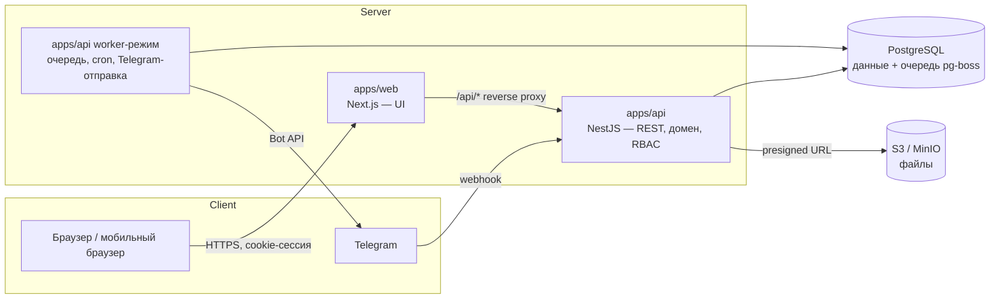

# Fluggi OS — Архитектура (предложение, этап 0)

> Статус: **согласовано 06.10.2026**. Phase 1 — Foundation реализована (см. §12).

Связанные документы:
[DATABASE.md](DATABASE.md) · [API.md](API.md) · [docs/PERMISSIONS.md](docs/PERMISSIONS.md) · [docs/BUSINESS_RULES.md](docs/BUSINESS_RULES.md)

---

## 1. Анализ ТЗ

### 1.1 Суть
Внутренняя ERP/CRM для одной компании (≈10–50 пользователей), где все модули — звенья одной цепочки:

```
Lead → Client/Deal → Meeting → Proposal → Contract → Payment ─┬→ Project → Tasks → Delivery
                                                              ├→ Commission
                                                              └→ Revenue
Project + Expenses → Profit → KPI/Salary → Follow-up → новая Deal (повторная продажа)
```

Ключевое следствие: модули **не независимы** — переход в одном модуле порождает
сущности в другом (оплата → проект + комиссия + уведомления). Поэтому центральная часть
архитектуры — доменные сервисы с транзакционными переходами и событийная шина для
побочных эффектов.

### 1.2 Нагрузка и масштаб
Пользователей мало, данных — сотни тысяч строк за годы. Высокая нагрузка не ожидается;
важнее **корректность денег, разграничение доступа и аудит**. Это обосновывает
модульный монолит, а не микросервисы.

### 1.3 Найденные неоднозначности и как я их предлагаю решить

| # | Вопрос в ТЗ | Предложение |
|---|-------------|-------------|
| A | Lead и Deal — отдельные сущности, но воронка одна (§7), а встреча (§13) ссылается и на лид, и на клиента. В сценарии §84 «ROP квалифицирует клиента» идёт **после** встречи. | **Lead** — входящий запрос (этапы: Новый лид → Связались → Квалификация → Назначена встреча → Встреча проведена). Квалификация лида = **конвертация**: создаётся/привязывается Client + Contact + **Deal**. Deal продолжает воронку: Потребность определена → КП отправлено → Переговоры → Договор → Ожидаем оплату → Оплачено. Экран «Воронка» показывает обе части как одну доску. Повторные продажи создают Deal сразу у существующего клиента, без лида. |
| B | «Выручка / Оплачено / Ожидается» на CEO-дашборде: 187.4 = 143 + 44.4 | **Выручка** = сумма подписанных договоров за период; **Оплачено** = PAID платежи; **Ожидается (дебиторка)** = Выручка − Оплачено − возвраты. |
| C | Прибыль: проектная или компании? | Показываем обе: **Валовая прибыль** = Выручка − проектные расходы; **Операционная** = Валовая − расходы компании − комиссии. |
| D | Частичные оплаты: когда создаётся проект и комиссия? | Проект — при **первом** платеже в статусе PAID по сделке (идемпотентно, один проект на сделку). Комиссия — **на каждый** PAID платёж пропорционально его сумме; возврат создаёт отрицательную комиссию. |
| E | «Клиент принимает КП» — клиентского портала в ТЗ нет | Менеджер отмечает статус «Принято» вручную. Ссылку для клиента на просмотр КП (статус «Просмотрено») — после MVP. |
| F | Валюты UZS/USD | Каждая денежная сумма хранится как `amount + currency + exchange_rate + amount_base` (база — UZS). Курс берётся из таблицы курсов на дату операции и фиксируется в записи, чтобы отчёты прошлых периодов не «плыли». |
| G | Динамические правила комиссий РОП (§34) | Правила — данные в БД: условие в виде ограниченного JSON-DSL (`{all:[{metric:"avg_check_usd",op:">",value:3000}]}`), валидируемого Zod. Без `eval`, без хардкода. |
| H | Telegram — основной мобильный канал | Отправка только через очередь с повторами и журналом доставки; падение Telegram не ломает бизнес-операцию. |

---

## 2. Архитектура

### 2.1 Обзор



**Модульный монолит**, разделённый на frontend и backend (как рекомендует §51 для
крупного проекта):

- **apps/web** — Next.js (App Router). Только интерфейс: никакой бизнес-логики и
  прямого доступа к БД. Права на фронтенде используются лишь чтобы скрыть кнопки.
- **apps/api** — NestJS. Вся бизнес-логика, авторизация, валидация, аудит.
  Тот же код запускается во втором процессе в **worker-режиме** (очереди, cron,
  Telegram), чтобы тяжёлые фоновые задачи не мешали API.
- **PostgreSQL** — единственное хранилище состояния, включая очередь задач
  (**pg-boss**). Redis не нужен: меньше инфраструктуры, а транзакционные гарантии лучше.
- **S3-совместимое хранилище** — файлы (MinIO локально, любой S3 в production).

Один домен: `crm.fluggi.uz` → `/` отдаётся Next.js, `/api/*` проксируется в NestJS.
Cookie первичные (first-party), CORS не нужен.

### 2.2 Слои backend-модуля

```
controller   — HTTP, Zod-валидация входа, guards (auth, permission)
service      — бизнес-правила, транзакции, публикация доменных событий
repository   — Prisma-запросы + обязательный scope-фильтр доступа
policy       — кто что видит (own / team / all) и какие поля (финансы)
events       — обработчики событий других модулей
```

Правило: модуль обращается к чужим данным только через **сервис** другого модуля
(или через событие), никогда напрямую через чужой репозиторий.

### 2.3 События и автоматизации (§54)

Используется паттерн **Transactional Outbox**:

1. Сервис в одной транзакции меняет данные **и** пишет запись в `outbox_events`.
2. Worker забирает событие и запускает подписчиков (уведомления, Telegram,
   напоминания, пересчёт метрик).
3. При ошибке — повтор с экспоненциальной задержкой; результат в журнале.

Разделение обязанностей:

| Синхронно (в той же транзакции) — критичные бизнес-правила | Асинхронно (через outbox) — побочные эффекты |
|---|---|
| Payment PAID → создание Project (Rule 3, 4) | Telegram-уведомления |
| Payment PAID → создание Commission (Rule 7) | In-app уведомления |
| Project COMPLETED → follow-up (Rule 8) | Пересчёт lead score, client health |
| Audit log (Rule 9) | Пересчёт кэшей KPI / LTV |
| Стадийная история сделки | Отчёты, экспорты |

Так оплата никогда не окажется «без проекта» из-за упавшего Telegram.

Список событий: `lead.created`, `lead.assigned`, `lead.converted`, `meeting.created`,
`meeting.completed`, `proposal.created`, `proposal.sent`, `proposal.accepted`,
`contract.created`, `contract.signed`, `payment.created`, `payment.paid`,
`payment.refunded`, `project.created`, `project.overdue`, `project.completed`,
`task.created`, `task.assigned`, `task.deadline_changed`, `task.overdue`,
`task.completed`, `deal.stage_changed`, `deal.won`, `deal.lost`, `target.achieved`.

**Automation Builder** (пользовательские правила «если событие → действие») — после MVP;
архитектура (каталог событий + подписчики) к нему готова.

### 2.4 Планировщик (§55)

pg-boss cron в worker-процессе (часовой пояс `Asia/Tashkent`):

| Расписание | Задача |
|---|---|
| каждые 5 мин | встречи через 30 мин → напоминание |
| каждый час | просроченные задачи/проекты/платежи → отметка + уведомление (с дедупликацией) |
| ежедневно 09:00 | встречи на сегодня/завтра, «не звонили 3 дня», «КП отправлено 2 дня назад», follow-up на сегодня |
| ежедневно 18:00 | отчёт CEO (§56), отчёт РОП |
| понедельник 09:00 | недельный отчёт (§57) |
| 1-е число 03:00 | снимок KPI за прошлый месяц, черновик зарплатной ведомости |

Каждое напоминание имеет `dedupe_key`, чтобы не отправлять дубли.

---

## 3. Технологический стек

| Слой | Выбор | Почему |
|---|---|---|
| Язык | TypeScript (strict) везде | ТЗ §80 |
| Монорепо | pnpm workspaces + Turborepo | общие типы/схемы для web и api |
| Frontend | Next.js 15.5, React 19.1, Tailwind CSS 4, shadcn/ui | ТЗ §51 |
| Данные на клиенте | TanStack Query | кэш, оптимистичный Kanban, ретраи |
| Формы | React Hook Form + Zod | ТЗ §51, те же схемы, что на backend |
| Таблицы | TanStack Table | сортировка, фильтры, адаптив |
| Drag & Drop | dnd-kit | Kanban, воронка |
| Графики | Recharts | ТЗ §51 |
| i18n | next-intl (ru — основной, uz/en — каркас) | ТЗ §2 |
| Backend | NestJS 11 | модули, DI, guards — естественно ложится на RBAC и домены |
| ORM | Prisma + миграции `prisma migrate` | ТЗ §51, §67 |
| БД | PostgreSQL 16 | ТЗ §47 |
| Очереди/cron | pg-boss | очередь в той же БД, без Redis |
| Auth | собственные серверные сессии: argon2id, httpOnly cookie, таблица `sessions` | Auth.js рассчитан на Next.js-backend; с отдельным NestJS проще и прозрачнее свои сессии (мгновенный отзыв, IP/UA в аудите) |
| Деньги | `Decimal(18,2)` в БД, `decimal.js` в коде | никаких float |
| Файлы | S3 API (`@aws-sdk/client-s3`), MinIO в dev | ТЗ §52 |
| PDF | `@react-pdf/renderer` со встроенным шрифтом (кириллица) | КП, отчёты; без headless-браузера |
| Excel/CSV | `exceljs` / потоковый CSV | ТЗ §44 |
| Telegram | grammY (webhook в prod, long polling в dev) | ТЗ §53 |
| Логи | pino (JSON) | серверные ошибки без утечки stack trace клиенту |
| Тесты | Vitest (unit), Vitest + Testcontainers Postgres (integration), Playwright (E2E) | ТЗ §83 |
| Окружение | Docker Compose (postgres, minio) для dev; Docker-образы web/api для prod | |

---

## 4. Структура проекта

```
fluggi/
├─ apps/
│  ├─ web/                          # Next.js
│  │  ├─ src/app/
│  │  │  ├─ (auth)/login/
│  │  │  └─ (app)/                  # layout: sidebar/drawer, header, период
│  │  │     ├─ dashboard/
│  │  │     ├─ sales/{leads,deals,pipeline,meetings,proposals,contracts}/
│  │  │     ├─ clients/  projects/  tasks/  team/
│  │  │     ├─ finance/{revenue,payments,expenses,profit,commissions}/
│  │  │     ├─ kpi/  attendance/  analytics/  notifications/  settings/
│  │  ├─ src/features/<module>/      # компоненты, хуки, формы конкретного модуля
│  │  ├─ src/components/ui/         # shadcn/ui
│  │  ├─ src/components/shared/     # DataTable, EmptyState, MoneyText, StatusBadge…
│  │  ├─ src/lib/                   # api-client, auth, format, query-client
│  │  └─ messages/{ru,uz,en}.json
│  │
│  └─ api/                          # NestJS
│     ├─ src/main.ts                # HTTP-режим
│     ├─ src/worker.ts              # worker-режим (очереди, cron, Telegram)
│     ├─ src/core/                  # auth, rbac, audit, outbox, errors, storage, config
│     └─ src/modules/
│        ├─ users/ teams/ employees/
│        ├─ leads/ clients/ deals/ activities/ meetings/
│        ├─ proposals/ contracts/ payments/
│        ├─ projects/ tasks/ templates/
│        ├─ finance/ expenses/ commissions/
│        ├─ kpi/ attendance/ payroll/
│        ├─ notifications/ telegram/ reminders/
│        ├─ analytics/ search/ exports/ files/ settings/
│        └─ <module>/{*.controller,*.service,*.repository,*.policy,*.events}.ts
│
├─ packages/
│  ├─ db/          # prisma/schema.prisma, migrations, seed
│  ├─ contracts/   # Zod-схемы запросов/ответов, enum'ы, коды прав — общие для web и api
│  ├─ domain/      # чистые функции: KPI, комиссии, зарплата, прибыль, конверсия,
│  │               # прогноз, lead score, client health (100% покрыты unit-тестами)
│  └─ config/      # eslint, tsconfig, prettier
│
├─ e2e/            # Playwright
├─ docker-compose.yml
├─ .env.example
└─ README.md ARCHITECTURE.md DATABASE.md API.md DEPLOYMENT.md ENVIRONMENT.md
```

`packages/domain` — сердце расчётов: без зависимостей от БД и фреймворков, поэтому
формулы ТЗ (§25, §32, §33, §40) тестируются изолированно.

---

## 5. Безопасность (§46)

| Требование | Реализация |
|---|---|
| Пароли | argon2id; минимальная длина 10; блокировка после 5 неудачных попыток на 15 мин |
| Сессии | случайный 256-бит токен в httpOnly + Secure + SameSite=Lax cookie; в БД хранится только SHA-256 хэш; скользящий срок 7 дней; отзыв всех сессий при смене пароля/блокировке |
| CSRF | SameSite=Lax + проверка `Origin` + double-submit токен в заголовке `X-CSRF-Token` для мутаций |
| RBAC | `PermissionGuard` на каждом endpoint + scope-фильтр в репозитории + policy для полей (финансы вырезаются из ответа, если нет `finance.read`) |
| Валидация | Zod на каждом входе; whitelist полей; лимиты размеров |
| SQL injection | только Prisma (параметризованные запросы); raw SQL — только `Prisma.sql` |
| XSS | React-экранирование; запрет `dangerouslySetInnerHTML`; CSP-заголовки; комментарии — plain text |
| Rate limiting | @nestjs/throttler: login 5/мин на IP+email, API 300/мин на пользователя |
| Загрузка файлов | presigned PUT с ограничением типа/размера; проверка magic bytes; приватный bucket; скачивание только через короткоживущий presigned GET после проверки прав |
| Двойной клик / дубли | заголовок `Idempotency-Key` на create-запросах + блокировка кнопки на фронтенде |
| Аудит | append-only `audit_logs`; на уровне БД у роли приложения нет `UPDATE/DELETE` на эту таблицу |
| Ошибки | единый формат; stack trace только в логах |
| Секреты | только `.env`; `.env` в `.gitignore`; демо-пароли генерируются при seed и выводятся в консоль |

---

## 6. Деньги и валюта
- Типы: `Decimal(18,2)`; округление банковское только на финальном шаге.
- Каждая сумма: `amount`, `currency` (`UZS|USD`), `exchange_rate` (к UZS на дату), `amount_uzs`.
- Агрегаты считаются по `amount_uzs`; в UI переключатель «показать в UZS / USD» конвертирует по текущему или историческому курсу.
- Курсы задаются вручную в «Настройки → Валюта» (автозагрузка курса ЦБ РУз — после MVP).

## 7. Локализация
Все строки UI через ключи `next-intl`; enum'ы приходят с backend кодами
(`DEAL_STAGE.NEGOTIATION`), перевод — на фронтенде. Справочники (услуги, источники) имеют
поля `name_ru`, `name_uz`, `name_en`. В MVP заполняется только `ru`.

## 8. Файлы
Метаданные в таблице `files`, содержимое — в S3. Ключ: `{entity}/{yyyy}/{mm}/{uuid}`.
Удаление — soft delete; физическая очистка по расписанию.

## 9. Тестирование (§83)
- **Unit** (`packages/domain`): KPI, комиссии (включая динамические правила), зарплата, прибыль/маржа, конверсия, прогноз, lead score.
- **Integration** (api + реальный Postgres в Testcontainers): Lead→Deal, Deal→Payment, Payment→Project+Commission, Project→Task, Task→Notification, scope-доступ по ролям.
- **E2E** (Playwright): полный сценарий §84 от входа CEO до обновления дашборда.
- CI (GitHub Actions): lint, typecheck, unit, integration, build; E2E — на PR в main.

---

## 10. Этапы

| Фаза | Содержание | Результат |
|---|---|---|
| **1. Foundation** | монорепо, Docker Compose, Prisma-схема ядра + миграции, auth/сессии, users/roles/permissions/teams, RBAC guard + scope, audit log, outbox, layout (sidebar/drawer, header, глобальный период), пустые разделы навигации по ролям, страница управления пользователями, seed пользователей, CI | можно войти под 5 ролями, CEO создаёт пользователя, меню зависит от роли |
| **2. CRM** | лиды, источники, скоринг, клиенты/контакты, сделки, воронка (DnD), история стадий, activity timeline, встречи, причины потерь | сценарий §84 шаги 3–8 |
| **3. Sales** | КП + позиции + версии + PDF, договоры + файлы, платежи + подтверждение | шаги 9–15 |
| **4. Projects** | авто-создание проекта, шаблоны, команда, задачи, Kanban, просрочки | шаги 16–21 |
| **5. Finance** | расходы, прибыль проекта/компании, комиссии + правила, финансовый дашборд | шаги 22–25 |
| **6. KPI** | цели, KPI менеджера/РОП/исполнителя, (после MVP: посещаемость, графики, зарплата) | шаг 26 |
| **7. Telegram** | бот, привязка аккаунта, уведомления, напоминания, ежедневный отчёт | шаги 6, 19 |
| **8. Analytics** | дашборды CEO/РОП/менеджера/исполнителя, прогноз, LTV, конверсии, поиск, экспорт | шаги 27–28 |

Telegram-уведомления входят в MVP; технически канал Telegram подключается в фазе 7,
но in-app уведомления работают с фазы 2, а события пишутся в outbox с фазы 1 —
поэтому подключение Telegram не потребует переделок.

**MVP** = фазы 1–5 + базовый KPI (фаза 6 без посещаемости/зарплаты) + фаза 7 + CEO-дашборд.
**После MVP**: посещаемость и графики, зарплата, расширенный движок комиссий (условия РОП),
прогноз, LTV, client health, расширенная аналитика, Automation Builder, клиентская ссылка на КП, uz/en переводы.

---

## 11. Согласованные решения (06.10.2026)

1. **Lead/Deal** — модель «лид → квалификация РОП → клиент + сделка», единая доска воронки. ✅
2. **Финансы** — Выручка = подписанные договоры, Оплачено = PAID платежи, Ожидается = разница; прибыль валовая и операционная. ✅
3. **Частичные оплаты** — проект при первом PAID платеже, комиссия с каждого платежа. ✅
4. **Отделы** — может быть несколько отделов продаж, у каждого свой РОП (`teams.head_id`). ✅
5. **Зарплаты** — каждый сотрудник видит только свою зарплату; зарплаты всех — только CEO. HR зарплат не видит. ✅
6. **Хостинг** — Beget. Требуется **Beget VPS / Cloud** (Ubuntu + Docker): Node.js-процессы и PostgreSQL на виртуальном хостинге Beget не запускаются. Файлы — Beget S3 (S3-совместимое). Подробности — DEPLOYMENT.md. ✅

Версии зафиксированы на стабильных ветках с долгой поддержкой: Next.js 15.5, React 19.1, NestJS 11, Prisma 6, TypeScript 5.9.

---

## 12. Phase 1 — что реализовано

| Область | Реализация |
|---|---|
| Монорепо | pnpm workspaces + Turborepo: `apps/api`, `apps/web`, `packages/contracts`, `packages/db` |
| БД | Prisma-схема ядра, миграция `init`, триггер append-only для `audit_logs`, seed (роли, права, 2 отдела, 12 демо-сотрудников, первый CEO для prod) |
| Аутентификация | argon2id, серверные сессии (в БД — только SHA-256 токена), httpOnly cookie, скользящий срок с продлением cookie, блокировка после 5 неудачных попыток на 15 мин, смена пароля с закрытием других сессий, список и завершение сеансов |
| CSRF | проверка `Origin` + double-submit токен (`X-CSRF-Token`) + `SameSite=Lax` |
| RBAC | права из БД с областью OWN/TEAM/ALL; глобальный `PermissionGuard` по принципу default deny (endpoint без объявленных требований недоступен; тест проверяет все endpoint'ы); `scopeWhere()` ограничивает выборки в репозиториях |
| Сотрудники / отделы / роли | CRUD сотрудников (временный пароль показывается один раз), блокировка, сброс пароля, несколько отделов с РОП, редактор прав ролей; защита: только CEO управляет CEO, нельзя заблокировать себя и последнего CEO, нельзя снять роль с РОП, руководящего отделом |
| Аудит | `AuditService` пишет «кто / что / когда / старое → новое / IP / сессия» в той же транзакции, что и изменение |
| События | `OutboxService.publish()` в транзакции; worker доставляет события через `FOR UPDATE SKIP LOCKED` с повторами |
| Ошибки | единый формат `{error:{code,message,details,requestId}}`, stack trace только в логах |
| Интерфейс | вход, layout с sidebar / мобильным drawer, меню по правам роли, глобальный период CEO, Dashboard, Команда (4 представления), Настройки (отделы, роли и права, журнал аудита), Профиль; состояния loading / error / empty, блокировка кнопок при отправке |
| i18n | next-intl: ru — полностью, uz/en — каркас с откатом на ru |
| Тесты | unit (contracts, api), интеграционные на реальной PostgreSQL, E2E Playwright (desktop + mobile) |
| CI | GitHub Actions: lint, typecheck, unit, integration, build, E2E |

### Отклонения от плана
- **pg-boss** перенесён в Phase 7 (там появятся cron-задачи). Для доставки событий сейчас достаточно outbox-worker'а на PostgreSQL (`SKIP LOCKED`) — без новой зависимости.
- **Idempotency-Key** на create-запросах вводится в Phase 2 вместе с лидами/сделками. В Phase 1 дубли исключены уникальностью email/названия отдела и блокировкой кнопок.
- Таблицы `settings` и `files` перенесены в Phase 2 — в Phase 1 им нечего хранить.
- ESLint пока не подключён; `pnpm lint` проверяет форматирование Prettier, типы проверяет `pnpm typecheck`.

## 13. Phase 2 — CRM: что реализовано

| Область | Реализация |
|---|---|
| Лиды | создание по минимуму полей (ТЗ §78) с раскрытием остальных, оценка лида 0–100 (Low/Medium/High/Hot) с пересчётом при каждом изменении, этапы с проверкой («Назначена встреча» — только при встрече), закрытие с обязательной причиной для «Потеряно/Отказ», возврат в работу, смена ответственного в зоне видимости, soft delete |
| Квалификация | лид → новый или существующий клиент (+ контакт из лида) + сделка; повторная продажа помечается автоматически |
| Сделки | суммы в UZS/USD с фиксацией курса, вероятность по этапу или вручную, взвешенная сумма, этапы (кроме «Оплачено» — только через оплату в Phase 3), закрытие с причиной |
| Воронка | единая доска лиды + сделки, drag & drop (мышь и touch) с оптимистичным обновлением и откатом при ошибке, pipeline и взвешенный прогноз, фильтры |
| Встречи | по лиду или сделке; РОП определяется по отделу; назначение/проведение двигает этап лида; перенос даты → статус «Перенесена» |
| Таймлайн и история | append-only (триггеры в БД): все действия, смены этапов с длительностью пребывания на этапе; таймлайн сделки включает историю лида |
| Уведомления | in-app: новый/назначенный лид, крупный лид (≥ 50 млн UZS) — РОП и CEO, новая/крупная сделка, потеря крупного клиента, новая встреча — РОП и менеджеру; счётчик в шапке |
| Справочники | услуги (цены, тип расчёта), источники, причины потерь, названия и вероятности этапов, курс USD (только CEO) |
| Защита от дублей | Idempotency-Key резервируется до выполнения запроса; формы создания отправляют ключ |
| Тесты | 40 интеграционных (в т.ч. шаги 3–8 сценария §84, разграничение данных, правила), 8 unit domain, E2E Phase 2 |

### Отклонения (Phase 2)
- Порог «крупного» лида/сделки (50 млн UZS) пока константа; станет настройкой в Phase 7 вместе с Telegram.
- Глобальный поиск по всем сущностям — Phase 8; сейчас поиск есть в каждом списке.

## 14. Phase 3 — Sales: что реализовано

| Область | Реализация |
|---|---|
| КП | позиции из справочника услуг или произвольные, скидка, итоги (domain `proposalTotals`), статусы черновик → на утверждении → утверждено → отправлено → просмотрено → принято/отклонено; изменение после отправки создаёт новую неизменяемую версию (append-only); PDF с кириллицей |
| Утверждение | менеджер отправляет КП на утверждение → РОП/CEO получает уведомление и утверждает; пока КП на утверждении, отправить его клиенту нельзя. Автоматический порог (сумма/скидка) — Phase 7 вместе с настройками |
| Договоры | из принятого КП или вручную, отправлен → подписан → отменён; подписание двигает сделку |
| Оплаты | менеджер вносит оплату (PENDING), подтверждает РОП/CEO в одной транзакции с блокировкой сделки: сделка → «Оплачено»/WON, при первой оплате создаётся проект `P-00001` (один на сделку), начисляются комиссии |
| Комиссии | правила в БД (условия `all/any` по метрикам месяца: средний чек USD, число заказов), выбирается правило с наивысшим приоритетом; на каждую оплату; возврат — отдельная оплата REFUND и сторнирующие (отрицательные) комиссии |
| Гейты этапов сделки | «КП отправлено» — сумма и отправленное КП; «Договор» — договор; «Ожидает оплаты» — подписанный договор; «Оплачено» — только автоматически |
| Файлы | вложения к сделке/КП/договору/оплате, проверка сигнатуры, драйверы local и S3 |
| Защита | удаление оплат, договоров и комиссий запрещено триггерами БД; все переходы — в аудите и таймлайне |
| Тесты | 47 интеграционных, 17 unit domain, E2E: КП → договор → оплата → проект и комиссии |

### Не реализовано в Phase 3 (явно)
- Редактор правил комиссий в интерфейсе — Phase 5 (сейчас правила задаются seed'ом и API `commission-rules`); комиссия от прибыли (`PERCENT_OF_PROFIT`) — Phase 5 вместе с расходами.
- Утверждение и выплата комиссий (`approve`/`mark-paid`) — Phase 5.
- Проекты пока только создаются и просматриваются; команда, задачи и Kanban — Phase 4.
- Ссылка для клиента на просмотр КП — после MVP (статус «Просмотрено» ставит менеджер).

## 15. Phase 4 — Проекты и задачи: что реализовано

| Область | Реализация |
|---|---|
| Проект | создаётся при первой оплате (Phase 3) + базовый чек-лист из шаблона услуги сделки (ТЗ §19 п.6); списки «Все / В работе / Просроченные / Завершённые», карточка с вкладками «Задачи», «Команда», «Файлы», «О проекте», «История» |
| Статусы проекта | Новый → Планирование (первый исполнитель) → В работе (первая задача в работе) — автоматически; остальные — вручную РОП/CEO. Завершить можно только без открытых задач, отменить — с причиной; закрытый проект можно вернуть в работу |
| Команда (§21) | роль, дата назначения, загрузка %, дедлайн участника, статус, счётчики задач; кандидаты — исполнители, менеджеры, РОП |
| Задачи (§22) | номер `T-00001`, исполнитель обязателен (Rule 5), приоритет, даты, прогресс %, комментарии, файлы, история статусов (append-only), счётчик переделок (возврат с проверки) |
| Kanban (§23) | 4 колонки, drag & drop мышью и пальцем, порядок карточек внутри колонки (дробный `sort_order`), оптимистичное обновление с откатом |
| Просрочки (§24) | «Просрочено N дней» в списках и на карточках; напоминания на 1/3/7 день (in-app; Telegram — Phase 7) |
| Права | исполнитель видит проекты, где он в команде, и только свои задачи; не видит стоимость проекта и сделку; поля задачи меняет руководитель проекта или автор, исполнитель — статус и прогресс; закрытую/отменённую задачу возвращает в работу только руководитель |
| Шаблоны (§62) | Настройки → «Шаблоны проектов»: задачи с ролью, смещением старта и длительностью; применение к проекту вручную |
| Тесты | 51 интеграционный (в т.ч. шаги 16–21 §84), 23 unit domain, E2E: шаблон → команда → Kanban |

### Не реализовано в Phase 4 (явно)
- Финансовая карточка проекта (стоимость, расходы, прибыль, маржа — ТЗ §25) — Phase 5.
- Follow-up после завершения проекта (Rule 8, ТЗ §38) — Phase 7 вместе с напоминаниями.
- Telegram-уведомления исполнителям — Phase 7 (сейчас in-app).
- Шаблоны КП, договоров и уведомлений (ТЗ §62) — после MVP; в Phase 4 — шаблоны проектов и задач.

## 16. Phase 5 — Финансы: что реализовано

| Область | Реализация |
|---|---|
| Расходы (§26) | 11 категорий; проектный расход (РОП — проекты отдела, CEO — все) и расход компании (только CEO); сумма в UZS/USD по курсу, получатель, описание; правка и мягкое удаление с аудитом |
| Финансы проекта (§25) | вкладка «Финансы» в проекте: стоимость, получено, осталось получить, расходы по категориям, валовая прибыль, маржинальность, комиссии по сделке; исполнитель и менеджер её не видят |
| Дашборд (§27) | выручка (подписанные договоры), получено, дебиторка, расходы, валовая и операционная прибыль, маржа, возвраты, комиссии; периоды «Сегодня / Неделя / Месяц / Квартал / Год / Свой»; РОП видит свой отдел без расходов компании |
| Прибыль по проектам | таблица проектов: стоимость, получено, расходы, прибыль, маржа |
| Комиссии (§32–34) | статусы «Начислена → Утверждена → Выплачена» (массово, CEO, с аудитом); правила в «Настройки → Правила комиссий»: % от оплаты, % от прибыли (маржа проекта на момент оплаты), фиксированная сумма; условия «все / любое» по среднему чеку, числу заказов и выручке за месяц |
| Удобство | суммы вводятся с разрядами (5 000 000); неподтверждённую оплату можно исправить, подтверждённую — только возвратом |
| Тесты | 56 интеграционных (пример ТЗ §25: маржа 47.78%), 26 unit domain, E2E финансов |

### Не реализовано в Phase 5 (явно)
- Зарплата (§32) с KPI-бонусом — Phase 6 вместе с KPI; утверждённые комиссии войдут в расчёт.
- Графики динамики выручки по дням/месяцам — Phase 8 (аналитика); сейчас — показатели за выбранный период.
- Вложение чека к расходу — после MVP (файлы уже есть у сделки, проекта и задачи).

## 17. Phase 6 — KPI и сотрудники: что реализовано

| Область | Реализация |
|---|---|
| Дашборды (§5, §58–60) | CEO: выручка, прибыль, оплачено, ожидается, новые лиды и сделки, договоры, проекты в работе; РОП: продажи отдела против цели, лиды, встречи, КП, договоры, оплаты, средний чек, конверсия и таблица менеджеров с KPI; менеджер: свои лиды, сделки, встречи, КП, продажи, цель, KPI, комиссия, задачи; исполнитель: проекты, задачи сегодня, просрочено, в работе, завершено |
| KPI (§28–30) | менеджер: лиды, обработанные, встречи, КП, договоры, оплаты, заказы, выручка, средний чек, конверсия; РОП: продажи отдела, заказы, средний чек, конверсия, менеджеры, выполнение плана, маржа, проекты, просрочки; исполнитель: задачи, выполнено, просрочено, среднее время, % выполнения, переделки |
| Цели (§31) | выручка (UZS/USD), заказы, лиды, встречи, задачи на месяц; выполнение %, общий KPI — среднее по целям. Ставят CEO/HR — всем, РОП — своему отделу (не себе) |
| Посещаемость (§35) | отметка прихода/ухода с главной; опоздание по графику с «льготными» минутами; HR/CEO вносят отпуск, больничный, выходной, исправляют время (с аудитом); итоги за период |
| Графики (§36) | график роли или индивидуальный (обучение), рабочие дни, начало/конец, льготные минуты |
| Зарплата (§32) | оклад + KPI-бонус + комиссия + прочие бонусы − штраф; комиссия — сумма утверждённых комиссий месяца (отдельно от оклада); черновик → утверждена → выплачена; свою видит каждый, все — только CEO |
| Тесты | 60 интеграционных, 31 unit domain, 14 E2E |

### Не реализовано в Phase 6 (явно)
- ~~Автоматическая отметка «отсутствовал»~~ — сделано в Phase 7 (задача планировщика в 20:00).
- Автоматический расчёт KPI-бонуса по правилам — KPI-бонус вносит CEO, система показывает выполнение KPI %.
- Аналитика по сотруднику на отдельной странице (§37) и графики — Phase 8.

## 18. Phase 7 — Telegram и автоматизация: что реализовано

| Область | Реализация |
|---|---|
| Telegram-бот (§53) | собственный клиент Bot API без сторонних библиотек; привязка по одноразовому коду (sha256 в БД, 15 минут) через deep link `t.me/<bot>?start=<код>`; `/stop` — отключение; один чат — один аккаунт; режимы polling (локально) и webhook (production, проверка секретного заголовка `timingSafeEqual`) |
| Доставка | in-app уведомление и строка `notification_deliveries` в одной операции; отправка из очереди `FOR UPDATE SKIP LOCKED`, до 5 попыток с паузой 30 с → 30 мин, учёт `retry_after`; 400/403 (бот заблокирован) — без повторов; тестовое сообщение из профиля |
| Личные настройки (§14) | каждый сотрудник включает/выключает типы уведомлений отдельно для CRM и Telegram; список типов зависит от роли |
| Умные напоминания (§41) | встреча завтра и через 30 минут; лиду не звонили 3 дня; клиент не отвечает 7 дней; КП без ответа 2 дня; договор не подписан 3 дня; оплата просрочена; проект заканчивается через 3 дня; просроченный проект — РОП и CEO. Каждое — один раз (`reminder_log`, уникальный ключ) |
| Планировщик (§55) | задачи по времени Ташкента: просрочки задач (каждый час), напоминания (15 мин), follow-up (09:00), ежедневный отчёт (18:00), отметка отсутствующих (20:00), недельный отчёт (пн 09:00), черновик зарплаты за прошлый месяц (1-го числа). Запуск фиксируется в `job_runs` с уникальным слотом — ровно один раз даже при нескольких worker'ах; пропущенный запуск догоняется в тот же день; ручной запуск из настроек |
| Отчёты (§56–57) | ежедневный: лиды, квалифицировано, встречи, КП, договоры, оплаты, новые проекты, просрочки, лучший менеджер, % плана месяца, прогноз (получено + взвешенная воронка); CEO — по компании, РОП — по отделу. Недельный (CEO): лиды, конверсия, сделки, выручка, средний чек, прибыль, расходы, проекты, просрочки, топ-3 менеджеров. Предпросмотр в настройках |
| Повторные продажи (§38, Rule 8) | при завершении проекта — follow-up менеджеру через 30/60/90 дней (интервалы и действия настраиваются); раздел «Продажи → Повторные продажи»: выполнить, пропустить, сразу создать сделку «Повторная продажа» |
| События | «Изменение дедлайна» задачи — исполнителю; «Месячный план выполнен» — CEO (по компании) и РОП (по отделу), один раз за месяц; порог «крупной» сделки — в настройках |
| Тесты | 67 интеграционных (Telegram — против локальной заглушки Bot API), 16 E2E |

### Не реализовано в Phase 7 (явно)
- Ответы на кнопки в Telegram (подтвердить оплату, принять задачу из чата) — после MVP; сейчас сообщение содержит ссылку «Открыть в CRM».
- Шаблоны текстов уведомлений в настройках (`notification_templates`) — тексты заданы в коде.
- Отчёты по e-mail — не требуются ТЗ; только CRM и Telegram.

## 19. Phase 8 — Аналитика, поиск, экспорт: что реализовано

| Область | Реализация |
|---|---|
| Продажи (§39) | выручка (подписанные договоры), оплачено (за вычетом возвратов), оплаченные сделки, лиды по дням / неделям / месяцам (шаг — по длине периода, по времени Ташкента); итоги, средний чек и % к прошлому периоду той же длины; таблица-дубль графика |
| Воронка (§39) | лиды периода → квалифицированы → встреча проведена → КП отправлено → договор подписан → оплачено; % от предыдущего шага и от лидов |
| Источники, услуги (§42) | лиды периода, сделки, оплаченные, конверсия, выручка и средний чек |
| Причины потерь | лиды и сделки, закрытые в периоде как «Потеряно» / «Отказ», и потерянная сумма |
| Прогноз (§40) | текущий и 2 следующих месяца: получено + ожидаемые оплаты по графику (просроченные — в текущий месяц) + открытые сделки × вероятность этапа по ожидаемой дате закрытия; сделки с ожидаемыми оплатами во взвешенную воронку не входят (без двойного счёта); план — сумма целей «Выручка» менеджеров |
| Клиенты (§43) | LTV — оплачено за всё время за вычетом возвратов; оплаченные сделки, средний чек, последний контакт (активность, проведённая встреча, оплата). «Здоровье» 0–100 по прозрачным правилам (`@fluggi/domain` `clientHealth`, причины видны в интерфейсе): молчание 30/60/90 дней, просроченные оплаты и проекты, проигранные сделки, плюс повторные покупки и проекты в работе. Пересчёт ежедневно в 06:00 (сохраняется в `clients.health`), переход в «Риск» — уведомление менеджеру |
| Права | всё по праву `analytics.read`: CEO — компания, РОП — отделы, менеджер — свои сделки; фильтр по сотруднику не расширяет область видимости |
| Поиск (§44) | ⌘K / Ctrl+K: клиенты, лиды, сделки, проекты, договоры, задачи, сотрудники — по названию, номеру (D-00012, ДГ-7), телефону; каждая сущность — только в пределах прав |
| Экспорт (§44) | лиды, сделки, клиенты (с LTV и здоровьем), оплаты, расходы, проекты, задачи — Excel (.xlsx) или CSV (UTF-8 с BOM, «;»); строго в пределах прав на сущность, право `export.run` (CEO, РОП, HR); защита от формул в ячейках; каждая выгрузка — в журнале аудита; до 50 000 строк |
| Пакет для бухгалтера | Финансы → «Пакет для бухгалтера» (CEO): один Excel за год — пояснения и реквизиты компании, сводка по строкам формы №2 за год и по месяцам, договоры, оплаты, расчёты с клиентами на 31.12 (дебиторка и авансы полученные), расходы с подсказкой счёта НСБУ №21, зарплата, комиссии, проекты. Баланс (форма №1) составляет бухгалтер: основных средств, кредитов, налогов и остатков денег в CRM нет — это перечислено в файле. Реквизиты — «Настройки → Автоматизация → Компания» |
| Графики | собственные SVG-компоненты без библиотек: линии с перекрестьем и подсказкой, полосы, колонки с накоплением и отметкой плана; проверенная на дальтонизм палитра, таблица-дубль у каждого графика |
| Тесты | 74 интеграционных, 61 unit (domain 37, contracts 15, api 9), 19 E2E |

### Не реализовано в Phase 8 (явно)
- Экспорт в PDF — только Excel и CSV (PDF есть у КП).
- Экспорт через фоновую очередь — файл формируется сразу (ограничение 50 000 строк); для объёма агентства этого достаточно.
- Страница аналитики по отдельному сотруднику (§37) — вместо неё фильтр «Сотрудник» в аналитике и раздел KPI.

## 20. Дела, регулярные задачи, чат

| Область | Реализация |
|---|---|
| Личные дела | отдельная сущность `todos` (не проектные задачи): задача, звонок, письмо, встреча, платёж, отчёт; приоритет, срок, связь с клиентом / сделкой / лидом (только видимыми пользователю). Себе — любой сотрудник; поручить другому — по праву `task.create` (РОП — своему отделу, CEO — всем). Видят исполнитель и поручивший, CEO — все. Исполнителю — уведомление о поручении, поручившему — о выполнении |
| «Список дел» | панель внизу каждой страницы (по дизайну): мои открытые дела и мои задачи по проектам, фильтр (все / личные / по проектам), сортировка по сроку или приоритету, быстрое добавление и отметка «выполнено»; страница «Мои дела» — мои, поручил я, все (CEO), регулярные |
| Регулярные дела | правила «ежемесячно / ежеквартально / ежегодно, N-го числа», дело появляется за N дней до срока (задача планировщика в 07:00, ровно один раз на срок — уникальный ключ `recurring_id + recurring_due`); период в названии подставляется от срока ({прошлый_месяц}, {прошлый_квартал}, {прошлый_год}, {год}). «Налоговый календарь IT-Park» одним нажатием: налог с оборота, НДФЛ, отчёт IT-Park (4-го), ИНПС (10-го), квартальные отчёты IT-Park и стат, баланс и форма №2 (декабрь), годовой стат (февраль) |
| Напоминания | «Сегодня срок» — утром с 09:00, «Просрочено» — один раз; в CRM и Telegram, по личным настройкам |
| Чат | личная переписка сотрудников во всплывающем окне; непрочитанные — счётчик на кнопке; новое сообщение — в Telegram не чаще одного раза до прочтения переписки; ссылка из Telegram открывает переписку. Обновление — опрос раз в 4 с в открытой переписке |
| Тесты | 78 интеграционных, 64 unit, 21 E2E |

### Не реализовано (явно)
- Групповые чаты, вложения и редактирование сообщений — только личная переписка текстом.
- Мгновенная доставка в чате (WebSocket) — опрос раз в 4 секунды; для команды агентства достаточно.
- Ответ на сообщение чата прямо из Telegram — по ссылке открывается CRM.


## 21. Тарифы, себестоимость и документы (Phase 10)

**Категории.** `expenses.category` — код из справочника `finance_categories` (EXPENSE/INCOME), CEO
переименовывает и отключает категории; используемую нельзя удалить. Флаг «накладной расход»
(аренда, офис) включает категорию в распределение накладных.

**Тарифы.** У услуги — тарифы (Эконом/Стандарт/Премиум): цена продажи и позиции исполнителей —
сдельные (работа × количество по ставке) и фиксированные (например, зарплата веб-разработчика за
проект). Менеджер выбирает тариф в КП. Событие `project.created` создаёт план себестоимости проекта
(`project_cost_lines`) из тарифов принятого КП; при добавлении участника (`project.member_added`)
строка назначается ему и берётся его личная ставка (`employee_rates`). «Начислить» превращает
строку в расход проекта категории «Исполнитель».

**Накладные.** Сумма накладных месяца делится на число активных проектов месяца (или на
фиксированный делитель из Настройки → Финансы); доля уменьшает чистую прибыль проекта.

**Документы.** `modules/documents`: сервис собирает модель документа (блоки: заголовок, абзацы,
таблица услуг, реквизиты сторон, подпись), четыре рендерера дают HTML (предпросмотр и печать),
PDF (pdfkit, шрифт DejaVu), Word (docx) и TXT с одним закреплённым дизайном. Текст договора —
шаблон в настройке `documents` с полями `{{contract.number}}` и вставками `[[services]]`,
`[[parties]]`; сумма прописью — `amountInWords` в `@fluggi/domain`. Права проверяются через
`ProposalsService.get` / `ContractsService.get` (те же области видимости, что у КП и договоров).
