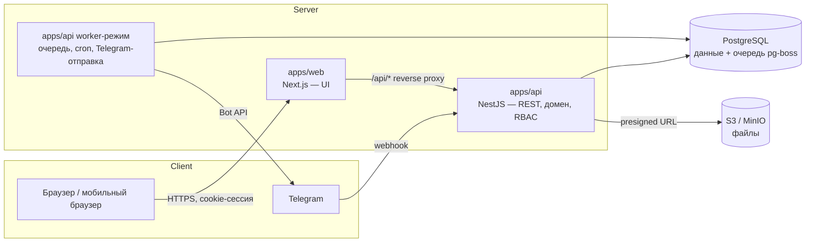

# Fluggi OS — Архитектура (предложение, этап 0)

> Статус: **черновик на согласование** (ТЗ §88, шаг 2). Код ещё не пишется.
> После подтверждения начинается Phase 1 — Foundation.

Связанные документы:
[DATABASE.md](DATABASE.md) · [API.md](API.md) · [docs/PERMISSIONS.md](docs/PERMISSIONS.md) · [docs/BUSINESS_RULES.md](docs/BUSINESS_RULES.md)

---

## 1. Анализ ТЗ

### 1.1 Суть
Внутренняя ERP/CRM для одной компании (≈10–50 пользователей), где все модули — звенья одной цепочки:

```
Lead → Client/Deal → Meeting → Proposal → Contract → Payment ─┬→ Project → Tasks → Delivery
                                                              ├→ Commission
                                                              └→ Revenue
Project + Expenses → Profit → KPI/Salary → Follow-up → новая Deal (повторная продажа)
```

Ключевое следствие: модули **не независимы** — переход в одном модуле порождает
сущности в другом (оплата → проект + комиссия + уведомления). Поэтому центральная часть
архитектуры — доменные сервисы с транзакционными переходами и событийная шина для
побочных эффектов.

### 1.2 Нагрузка и масштаб
Пользователей мало, данных — сотни тысяч строк за годы. Высокая нагрузка не ожидается;
важнее **корректность денег, разграничение доступа и аудит**. Это обосновывает
модульный монолит, а не микросервисы.

### 1.3 Найденные неоднозначности и как я их предлагаю решить

| # | Вопрос в ТЗ | Предложение |
|---|-------------|-------------|
| A | Lead и Deal — отдельные сущности, но воронка одна (§7), а встреча (§13) ссылается и на лид, и на клиента. В сценарии §84 «ROP квалифицирует клиента» идёт **после** встречи. | **Lead** — входящий запрос (этапы: Новый лид → Связались → Квалификация → Назначена встреча → Встреча проведена). Квалификация лида = **конвертация**: создаётся/привязывается Client + Contact + **Deal**. Deal продолжает воронку: Потребность определена → КП отправлено → Переговоры → Договор → Ожидаем оплату → Оплачено. Экран «Воронка» показывает обе части как одну доску. Повторные продажи создают Deal сразу у существующего клиента, без лида. |
| B | «Выручка / Оплачено / Ожидается» на CEO-дашборде: 187.4 = 143 + 44.4 | **Выручка** = сумма подписанных договоров за период; **Оплачено** = PAID платежи; **Ожидается (дебиторка)** = Выручка − Оплачено − возвраты. |
| C | Прибыль: проектная или компании? | Показываем обе: **Валовая прибыль** = Выручка − проектные расходы; **Операционная** = Валовая − расходы компании − комиссии. |
| D | Частичные оплаты: когда создаётся проект и комиссия? | Проект — при **первом** платеже в статусе PAID по сделке (идемпотентно, один проект на сделку). Комиссия — **на каждый** PAID платёж пропорционально его сумме; возврат создаёт отрицательную комиссию. |
| E | «Клиент принимает КП» — клиентского портала в ТЗ нет | Менеджер отмечает статус «Принято» вручную. Ссылку для клиента на просмотр КП (статус «Просмотрено») — после MVP. |
| F | Валюты UZS/USD | Каждая денежная сумма хранится как `amount + currency + exchange_rate + amount_base` (база — UZS). Курс берётся из таблицы курсов на дату операции и фиксируется в записи, чтобы отчёты прошлых периодов не «плыли». |
| G | Динамические правила комиссий РОП (§34) | Правила — данные в БД: условие в виде ограниченного JSON-DSL (`{all:[{metric:"avg_check_usd",op:">",value:3000}]}`), валидируемого Zod. Без `eval`, без хардкода. |
| H | Telegram — основной мобильный канал | Отправка только через очередь с повторами и журналом доставки; падение Telegram не ломает бизнес-операцию. |

---

## 2. Архитектура

### 2.1 Обзор



**Модульный монолит**, разделённый на frontend и backend (как рекомендует §51 для
крупного проекта):

- **apps/web** — Next.js (App Router). Только интерфейс: никакой бизнес-логики и
  прямого доступа к БД. Права на фронтенде используются лишь чтобы скрыть кнопки.
- **apps/api** — NestJS. Вся бизнес-логика, авторизация, валидация, аудит.
  Тот же код запускается во втором процессе в **worker-режиме** (очереди, cron,
  Telegram), чтобы тяжёлые фоновые задачи не мешали API.
- **PostgreSQL** — единственное хранилище состояния, включая очередь задач
  (**pg-boss**). Redis не нужен: меньше инфраструктуры, а транзакционные гарантии лучше.
- **S3-совместимое хранилище** — файлы (MinIO локально, любой S3 в production).

Один домен: `crm.fluggi.uz` → `/` отдаётся Next.js, `/api/*` проксируется в NestJS.
Cookie первичные (first-party), CORS не нужен.

### 2.2 Слои backend-модуля

```
controller   — HTTP, Zod-валидация входа, guards (auth, permission)
service      — бизнес-правила, транзакции, публикация доменных событий
repository   — Prisma-запросы + обязательный scope-фильтр доступа
policy       — кто что видит (own / team / all) и какие поля (финансы)
events       — обработчики событий других модулей
```

Правило: модуль обращается к чужим данным только через **сервис** другого модуля
(или через событие), никогда напрямую через чужой репозиторий.

### 2.3 События и автоматизации (§54)

Используется паттерн **Transactional Outbox**:

1. Сервис в одной транзакции меняет данные **и** пишет запись в `outbox_events`.
2. Worker забирает событие и запускает подписчиков (уведомления, Telegram,
   напоминания, пересчёт метрик).
3. При ошибке — повтор с экспоненциальной задержкой; результат в журнале.

Разделение обязанностей:

| Синхронно (в той же транзакции) — критичные бизнес-правила | Асинхронно (через outbox) — побочные эффекты |
|---|---|
| Payment PAID → создание Project (Rule 3, 4) | Telegram-уведомления |
| Payment PAID → создание Commission (Rule 7) | In-app уведомления |
| Project COMPLETED → follow-up (Rule 8) | Пересчёт lead score, client health |
| Audit log (Rule 9) | Пересчёт кэшей KPI / LTV |
| Стадийная история сделки | Отчёты, экспорты |

Так оплата никогда не окажется «без проекта» из-за упавшего Telegram.

Список событий: `lead.created`, `lead.assigned`, `lead.converted`, `meeting.created`,
`meeting.completed`, `proposal.created`, `proposal.sent`, `proposal.accepted`,
`contract.created`, `contract.signed`, `payment.created`, `payment.paid`,
`payment.refunded`, `project.created`, `project.overdue`, `project.completed`,
`task.created`, `task.assigned`, `task.deadline_changed`, `task.overdue`,
`task.completed`, `deal.stage_changed`, `deal.won`, `deal.lost`, `target.achieved`.

**Automation Builder** (пользовательские правила «если событие → действие») — после MVP;
архитектура (каталог событий + подписчики) к нему готова.

### 2.4 Планировщик (§55)

pg-boss cron в worker-процессе (часовой пояс `Asia/Tashkent`):

| Расписание | Задача |
|---|---|
| каждые 5 мин | встречи через 30 мин → напоминание |
| каждый час | просроченные задачи/проекты/платежи → отметка + уведомление (с дедупликацией) |
| ежедневно 09:00 | встречи на сегодня/завтра, «не звонили 3 дня», «КП отправлено 2 дня назад», follow-up на сегодня |
| ежедневно 18:00 | отчёт CEO (§56), отчёт РОП |
| понедельник 09:00 | недельный отчёт (§57) |
| 1-е число 03:00 | снимок KPI за прошлый месяц, черновик зарплатной ведомости |

Каждое напоминание имеет `dedupe_key`, чтобы не отправлять дубли.

---

## 3. Технологический стек

| Слой | Выбор | Почему |
|---|---|---|
| Язык | TypeScript (strict) везде | ТЗ §80 |
| Монорепо | pnpm workspaces + Turborepo | общие типы/схемы для web и api |
| Frontend | Next.js 15, React 19, Tailwind CSS 4, shadcn/ui | ТЗ §51 |
| Данные на клиенте | TanStack Query | кэш, оптимистичный Kanban, ретраи |
| Формы | React Hook Form + Zod | ТЗ §51, те же схемы, что на backend |
| Таблицы | TanStack Table | сортировка, фильтры, адаптив |
| Drag & Drop | dnd-kit | Kanban, воронка |
| Графики | Recharts | ТЗ §51 |
| i18n | next-intl (ru — основной, uz/en — каркас) | ТЗ §2 |
| Backend | NestJS 11 | модули, DI, guards — естественно ложится на RBAC и домены |
| ORM | Prisma + миграции `prisma migrate` | ТЗ §51, §67 |
| БД | PostgreSQL 16 | ТЗ §47 |
| Очереди/cron | pg-boss | очередь в той же БД, без Redis |
| Auth | собственные серверные сессии: argon2id, httpOnly cookie, таблица `sessions` | Auth.js рассчитан на Next.js-backend; с отдельным NestJS проще и прозрачнее свои сессии (мгновенный отзыв, IP/UA в аудите) |
| Деньги | `Decimal(18,2)` в БД, `decimal.js` в коде | никаких float |
| Файлы | S3 API (`@aws-sdk/client-s3`), MinIO в dev | ТЗ §52 |
| PDF | `@react-pdf/renderer` со встроенным шрифтом (кириллица) | КП, отчёты; без headless-браузера |
| Excel/CSV | `exceljs` / потоковый CSV | ТЗ §44 |
| Telegram | grammY (webhook в prod, long polling в dev) | ТЗ §53 |
| Логи | pino (JSON) | серверные ошибки без утечки stack trace клиенту |
| Тесты | Vitest (unit), Vitest + Testcontainers Postgres (integration), Playwright (E2E) | ТЗ §83 |
| Окружение | Docker Compose (postgres, minio) для dev; Docker-образы web/api для prod | |

---

## 4. Структура проекта

```
fluggi/
├─ apps/
│  ├─ web/                          # Next.js
│  │  ├─ src/app/
│  │  │  ├─ (auth)/login/
│  │  │  └─ (app)/                  # layout: sidebar/drawer, header, период
│  │  │     ├─ dashboard/
│  │  │     ├─ sales/{leads,deals,pipeline,meetings,proposals,contracts}/
│  │  │     ├─ clients/  projects/  tasks/  team/
│  │  │     ├─ finance/{revenue,payments,expenses,profit,commissions}/
│  │  │     ├─ kpi/  attendance/  analytics/  notifications/  settings/
│  │  ├─ src/features/<module>/      # компоненты, хуки, формы конкретного модуля
│  │  ├─ src/components/ui/         # shadcn/ui
│  │  ├─ src/components/shared/     # DataTable, EmptyState, MoneyText, StatusBadge…
│  │  ├─ src/lib/                   # api-client, auth, format, query-client
│  │  └─ messages/{ru,uz,en}.json
│  │
│  └─ api/                          # NestJS
│     ├─ src/main.ts                # HTTP-режим
│     ├─ src/worker.ts              # worker-режим (очереди, cron, Telegram)
│     ├─ src/core/                  # auth, rbac, audit, outbox, errors, storage, config
│     └─ src/modules/
│        ├─ users/ teams/ employees/
│        ├─ leads/ clients/ deals/ activities/ meetings/
│        ├─ proposals/ contracts/ payments/
│        ├─ projects/ tasks/ templates/
│        ├─ finance/ expenses/ commissions/
│        ├─ kpi/ attendance/ payroll/
│        ├─ notifications/ telegram/ reminders/
│        ├─ analytics/ search/ exports/ files/ settings/
│        └─ <module>/{*.controller,*.service,*.repository,*.policy,*.events}.ts
│
├─ packages/
│  ├─ db/          # prisma/schema.prisma, migrations, seed
│  ├─ contracts/   # Zod-схемы запросов/ответов, enum'ы, коды прав — общие для web и api
│  ├─ domain/      # чистые функции: KPI, комиссии, зарплата, прибыль, конверсия,
│  │               # прогноз, lead score, client health (100% покрыты unit-тестами)
│  └─ config/      # eslint, tsconfig, prettier
│
├─ e2e/            # Playwright
├─ docker-compose.yml
├─ .env.example
└─ README.md ARCHITECTURE.md DATABASE.md API.md DEPLOYMENT.md ENVIRONMENT.md
```

`packages/domain` — сердце расчётов: без зависимостей от БД и фреймворков, поэтому
формулы ТЗ (§25, §32, §33, §40) тестируются изолированно.

---

## 5. Безопасность (§46)

| Требование | Реализация |
|---|---|
| Пароли | argon2id; минимальная длина 10; блокировка после 5 неудачных попыток на 15 мин |
| Сессии | случайный 256-бит токен в httpOnly + Secure + SameSite=Lax cookie; в БД хранится только SHA-256 хэш; скользящий срок 7 дней; отзыв всех сессий при смене пароля/блокировке |
| CSRF | SameSite=Lax + проверка `Origin` + double-submit токен в заголовке `X-CSRF-Token` для мутаций |
| RBAC | `PermissionGuard` на каждом endpoint + scope-фильтр в репозитории + policy для полей (финансы вырезаются из ответа, если нет `finance.read`) |
| Валидация | Zod на каждом входе; whitelist полей; лимиты размеров |
| SQL injection | только Prisma (параметризованные запросы); raw SQL — только `Prisma.sql` |
| XSS | React-экранирование; запрет `dangerouslySetInnerHTML`; CSP-заголовки; комментарии — plain text |
| Rate limiting | @nestjs/throttler: login 5/мин на IP+email, API 300/мин на пользователя |
| Загрузка файлов | presigned PUT с ограничением типа/размера; проверка magic bytes; приватный bucket; скачивание только через короткоживущий presigned GET после проверки прав |
| Двойной клик / дубли | заголовок `Idempotency-Key` на create-запросах + блокировка кнопки на фронтенде |
| Аудит | append-only `audit_logs`; на уровне БД у роли приложения нет `UPDATE/DELETE` на эту таблицу |
| Ошибки | единый формат; stack trace только в логах |
| Секреты | только `.env`; `.env` в `.gitignore`; демо-пароли генерируются при seed и выводятся в консоль |

---

## 6. Деньги и валюта
- Типы: `Decimal(18,2)`; округление банковское только на финальном шаге.
- Каждая сумма: `amount`, `currency` (`UZS|USD`), `exchange_rate` (к UZS на дату), `amount_uzs`.
- Агрегаты считаются по `amount_uzs`; в UI переключатель «показать в UZS / USD» конвертирует по текущему или историческому курсу.
- Курсы задаются вручную в «Настройки → Валюта» (автозагрузка курса ЦБ РУз — после MVP).

## 7. Локализация
Все строки UI через ключи `next-intl`; enum'ы приходят с backend кодами
(`DEAL_STAGE.NEGOTIATION`), перевод — на фронтенде. Справочники (услуги, источники) имеют
поля `name_ru`, `name_uz`, `name_en`. В MVP заполняется только `ru`.

## 8. Файлы
Метаданные в таблице `files`, содержимое — в S3. Ключ: `{entity}/{yyyy}/{mm}/{uuid}`.
Удаление — soft delete; физическая очистка по расписанию.

## 9. Тестирование (§83)
- **Unit** (`packages/domain`): KPI, комиссии (включая динамические правила), зарплата, прибыль/маржа, конверсия, прогноз, lead score.
- **Integration** (api + реальный Postgres в Testcontainers): Lead→Deal, Deal→Payment, Payment→Project+Commission, Project→Task, Task→Notification, scope-доступ по ролям.
- **E2E** (Playwright): полный сценарий §84 от входа CEO до обновления дашборда.
- CI (GitHub Actions): lint, typecheck, unit, integration, build; E2E — на PR в main.

---

## 10. Этапы

| Фаза | Содержание | Результат |
|---|---|---|
| **1. Foundation** | монорепо, Docker Compose, Prisma-схема ядра + миграции, auth/сессии, users/roles/permissions/teams, RBAC guard + scope, audit log, outbox, layout (sidebar/drawer, header, глобальный период), пустые разделы навигации по ролям, страница управления пользователями, seed пользователей, CI | можно войти под 5 ролями, CEO создаёт пользователя, меню зависит от роли |
| **2. CRM** | лиды, источники, скоринг, клиенты/контакты, сделки, воронка (DnD), история стадий, activity timeline, встречи, причины потерь | сценарий §84 шаги 3–8 |
| **3. Sales** | КП + позиции + версии + PDF, договоры + файлы, платежи + подтверждение | шаги 9–15 |
| **4. Projects** | авто-создание проекта, шаблоны, команда, задачи, Kanban, просрочки | шаги 16–21 |
| **5. Finance** | расходы, прибыль проекта/компании, комиссии + правила, финансовый дашборд | шаги 22–25 |
| **6. KPI** | цели, KPI менеджера/РОП/исполнителя, (после MVP: посещаемость, графики, зарплата) | шаг 26 |
| **7. Telegram** | бот, привязка аккаунта, уведомления, напоминания, ежедневный отчёт | шаги 6, 19 |
| **8. Analytics** | дашборды CEO/РОП/менеджера/исполнителя, прогноз, LTV, конверсии, поиск, экспорт | шаги 27–28 |

Telegram-уведомления входят в MVP; технически канал Telegram подключается в фазе 7,
но in-app уведомления работают с фазы 2, а события пишутся в outbox с фазы 1 —
поэтому подключение Telegram не потребует переделок.

**MVP** = фазы 1–5 + базовый KPI (фаза 6 без посещаемости/зарплаты) + фаза 7 + CEO-дашборд.
**После MVP**: посещаемость и графики, зарплата, расширенный движок комиссий (условия РОП),
прогноз, LTV, client health, расширенная аналитика, Automation Builder, клиентская ссылка на КП, uz/en переводы.

---

## 11. Вопросы для подтверждения

1. **Lead/Deal** — согласны с моделью «лид конвертируется в сделку после квалификации» (п. 1.3-A)?
2. **Определения финансов** (п. 1.3-B/C/D) — так считаете выручку, прибыль и комиссию с частичных оплат?
3. **Отделы** — один РОП = один отдел продаж, или может быть несколько отделов/РОП? (схема поддерживает несколько.)
4. **HR/Admin и зарплаты** — HR видит зарплаты сотрудников или только CEO?
5. **Хостинг** — где планируется развёртывание (VPS в Узбекистане, облако)? Влияет на DEPLOYMENT.md и выбор S3.
6. **Комиссии по умолчанию** — менеджер 10% и РОП 10% **от выручки** (оплаты), верно?
