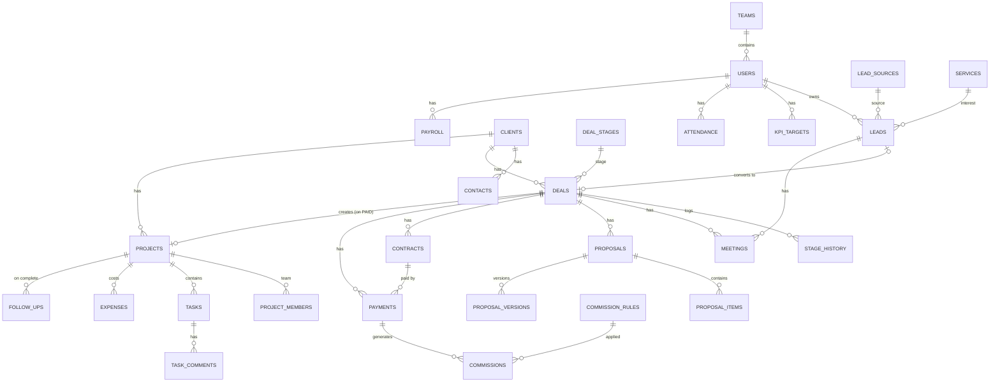

# Fluggi OS — Схема базы данных (предложение)

> Статус: **согласовано**. Реализованные таблицы — в `packages/db/prisma/schema.prisma`;
> каждая следующая фаза добавляет свои таблицы новой миграцией. Поля могут уточняться.
>
> ✅ Реализовано: Phase 1 (пользователи, роли, отделы, сессии, аудит, outbox), Phase 2 (CRM), Phase 3 (proposals, proposal_items, proposal_versions, contracts, payments, projects, commission_rules, commissions, stored_files), Phase 4 (project_members, tasks, task_status_history — append-only, task_comments, project_templates, task_templates; `project_id`/`task_id` в activities и files). Отличия от плана ниже: у `tasks` нет колонки `is_overdue` — просрочка считается из `deadline` и статуса, а `overdue_notified_at` фиксирует последнее напоминание; `templateRole` хранит роль задачи из шаблона. Phase 5: `expenses` (номер `EXP-00001`, CHECK: проектный расход — с проектом, расход компании — без; сумма > 0; мягкое удаление), в `commissions` — `approved_by_id/approved_at/paid_by_id/paid_at`. Phase 6: `kpi_targets`, `work_schedules`, `attendance`, `payroll_entries` (удаление запрещено триггером), в `employees` — `base_salary` и `schedule_id`. Отличие от плана: `kpi_results` (снимки) не создаётся — KPI считается из исходных данных за любой месяц, прошлые месяцы не «плывут», потому что исходные записи неизменяемы.

## 1. Соглашения

| Правило | Значение |
|---|---|
| СУБД | MySQL 8.0 / 5.7 (utf8mb4). До октября 2026 — PostgreSQL; переведено для виртуального хостинга Beget |
| Первичный ключ | `id CHAR(36)` — UUID, генерирует приложение |
| Человекочитаемые номера | `number` — AUTO_INCREMENT: `L-00001`, `D-00001`, `P-00001`, `KP-2026-0001`, `C-2026-0001`, `PAY-00001` |
| Метки времени | `created_at`, `updated_at` (DATETIME(3), UTC) — во всех изменяемых таблицах |
| Soft delete | `deleted_at` у leads, clients, deals, contracts, projects, tasks, expenses, files. Для `payments`, `commissions`, `kpi_results`, `audit_logs`, `activities` удаление запрещено вовсе (только смена статуса / сторно) |
| Деньги | `amount numeric(18,2)`, `currency` (`UZS`/`USD`), `exchange_rate numeric(18,6)`, `amount_uzs numeric(18,2)` |
| Полиморфные связи | явные nullable FK (`lead_id`, `deal_id`, `client_id`, `project_id`, `task_id`…), а не пара `entity_type/entity_id` — чтобы сохранить ссылочную целостность |
| Справочники с переводом | `name_ru`, `name_uz`, `name_en` |
| Индексы | на все FK, `status`, `owner_id`, `created_at`; GIN trigram-индексы для глобального поиска (§42) |
| Миграции | только `prisma migrate` (§67) |

## 2. ERD — главная цепочка

## 3. Таблицы

### 3.1 Пользователи и доступ

**users** — учётная запись
`id, email (unique), phone, password_hash, full_name, avatar_file_id, role_id → roles, team_id → teams, position, status (ACTIVE|BLOCKED), locale (ru|uz|en), telegram_chat_id (unique, null), telegram_username, failed_login_count, locked_until, last_login_at, created_at, updated_at, deleted_at`

**roles** — `id, code (CEO|ROP|MANAGER|EXECUTOR|HR_ADMIN), name, is_system, created_at, updated_at`

**permissions** — `id, code (напр. deal.read, payment.confirm, finance.read), module, description`

**role_permissions** — `role_id, permission_id, scope (OWN|TEAM|ALL)` · PK (role_id, permission_id)

**teams** — отдел продаж
`id, name, head_id → users (РОП), created_at, updated_at`

**employees** — HR-данные (отделены от users, чтобы не светить их в CRM)
`id, user_id (unique), specialty (SMM|DESIGNER|VIDEOGRAPHER|EDITOR|TARGETOLOGIST|DEVELOPER|PHOTOGRAPHER|COPYWRITER|null), base_salary, salary_currency, work_schedule_id, hired_at, fired_at, birth_date, passport_note, created_at, updated_at`

**sessions** — `id, user_id, token_hash (unique), ip, user_agent, created_at, last_seen_at, expires_at, revoked_at`

**telegram_link_tokens** — `token_hash, user_id, expires_at, used_at`

### 3.2 Справочники и настройки

**services** — каталог услуг (§61)
`id, code, name_ru/uz/en, description, base_price, min_price, currency, pricing_type (FIXED|MONTHLY|HOURLY|CUSTOM), default_project_template_id, is_active, sort`

**lead_sources** — `id, code, name_ru/uz/en, is_active, sort`

**loss_reasons** — `id, code, name_ru/uz/en, is_active, sort`

**deal_stages** — этапы воронки (§7)
`id, code (NEW|CONTACTED|QUALIFICATION|MEETING_SCHEDULED|MEETING_DONE|NEED_DEFINED|PROPOSAL_SENT|NEGOTIATION|CONTRACT|AWAITING_PAYMENT|PAID|LOST|REJECTED|PAUSED|NO_RESPONSE), entity (LEAD|DEAL), name_ru/uz/en, sort, probability (0–100, для прогноза), is_final, color, required_fields jsonb`
`code` фиксирован и используется бизнес-правилами; название, порядок, вероятность и цвет редактируются.

**exchange_rates** — `id, date, currency_from, currency_to, rate, set_by, created_at` · unique (date, from, to)

**settings** — `key (PK), value jsonb, updated_by, updated_at` — веса lead scoring, пороги «крупного» лида/сделки, интервалы follow-up (30/60/90), план месяца компании и т.д.

**number_sequences** — не нужна: номера — AUTO_INCREMENT-колонки.

**Особенности MySQL.** Свободный текст — `TEXT`, ключи и индексируемые строки — `VARCHAR(191)`. Поиск без учёта регистра обеспечивает collation `utf8mb4_unicode_ci`. Время в запросах — `UTC_TIMESTAMP(3)` (часовой пояс сервера не важен). Очереди (outbox, Telegram) берут строки `FOR UPDATE SKIP LOCKED` на MySQL 8 и `FOR UPDATE` на 5.7. Неизменяемость журналов, истории и запрет удаления оплат/договоров/комиссий/зарплаты — триггеры `packages/db/prisma/protect.sql` (отдельно от миграций: на хостинге без права их создавать CRM работает и без них).

### 3.3 CRM

**leads** (§8)
`id, number, title, contact_name, company_name, phone, telegram, whatsapp, instagram, email, website, city, country, source_id, owner_id (менеджер), team_id (→ РОП), service_id, budget, currency, desired_deadline, priority (LOW|MEDIUM|HIGH|URGENT), stage_id, status (OPEN|CONVERTED|LOST|PAUSED|NO_RESPONSE), score (0–100), score_level (LOW|MEDIUM|HIGH|HOT), score_factors jsonb (urgency, service_fit, company_size, interest, probability), next_contact_at, last_contact_at, comment, client_id, deal_id, converted_at, lost_reason_id, lost_comment, created_by, created_at, updated_at, deleted_at`

**clients**
`id, number, name, type (COMPANY|PERSON), industry, phone, email, telegram, website, city, country, owner_id, team_id, health (HEALTHY|ATTENTION|RISK|LOST), health_reasons jsonb, ltv_uzs (кэш), first_lead_id, source_id, created_at, updated_at, deleted_at`

**contacts** — `id, client_id, full_name, position, phone, telegram, whatsapp, instagram, email, is_primary, created_at, updated_at`

**deals**
`id, number, title, client_id (NOT NULL), contact_id, lead_id, owner_id (менеджер), team_id, service_id, amount, currency, exchange_rate, amount_uzs, stage_id, probability_override, expected_close_date, status (OPEN|WON|LOST|PAUSED), paid_total_uzs (кэш), lost_reason_id, lost_comment, won_at, lost_at, is_repeat, created_by, created_at, updated_at, deleted_at`

**stage_history** — каждый переход (§7)
`id, lead_id, deal_id, from_stage_id, to_stage_id, changed_by, duration_sec (время на предыдущей стадии), comment, created_at` — без update/delete

**activities** — бизнес-таймлайн (§12), append-only
`id, type (LEAD_CREATED|STAGE_CHANGED|CALL|MEETING_*|PROPOSAL_*|CONTRACT_*|PAYMENT_*|FIELD_CHANGED|COMMENT|…), actor_id, lead_id, deal_id, client_id, project_id, payload jsonb, created_at`

**comments** — `id, author_id, body (plain text), lead_id, deal_id, client_id, project_id, created_at, updated_at, deleted_at`

**meetings** (§13)
`id, lead_id, deal_id, client_id, manager_id, rop_id, starts_at, duration_min, type (ONLINE|OFFLINE|PHONE|TELEGRAM|GOOGLE_MEET|ZOOM), link_or_location, status (SCHEDULED|CONFIRMED|DONE|RESCHEDULED|CANCELLED|NO_SHOW), comment, result, reminded_day_at, reminded_30m_at, created_by, created_at, updated_at`

**follow_ups** (§38) — `id, client_id, project_id, deal_id, owner_id, due_at, kind (CONTACT|NEW_PROJECT|REPEAT_SALE), status (PENDING|DONE|SKIPPED), result_deal_id, created_at, updated_at`

### 3.4 Продажи

**proposals** (§15)
`id, number, deal_id, client_id, manager_id, template_id, status (DRAFT|SENT|VIEWED|IN_APPROVAL|ACCEPTED|REJECTED|EXPIRED), currency, subtotal, discount_amount, total, total_uzs, implementation_term, payment_terms, valid_until, current_version, approved_by, approved_at, sent_at, viewed_at, accepted_at, rejected_at, pdf_file_id, created_at, updated_at`

**proposal_items** — `id, proposal_id, service_id, description, quantity, unit_price, discount_pct, total, sort`

**proposal_versions** (§16) — `id, proposal_id, version, snapshot jsonb (шапка + позиции), total, author_id, change_comment, diff jsonb, created_at` · unique (proposal_id, version)

**contracts** (§17)
`id, number, deal_id, client_id, proposal_id, contract_date, amount, currency, exchange_rate, amount_uzs, status (DRAFT|SENT|IN_APPROVAL|SIGNED|CANCELLED), file_id, signed_at, template_id, created_by, created_at, updated_at, deleted_at`

**payments** (§18)
`id, number, client_id, deal_id (NOT NULL), contract_id, project_id, amount, currency, exchange_rate, amount_uzs, due_date, paid_at, type (PREPAYMENT|PARTIAL|FULL|FINAL|REFUND), method (CASH|BANK|CARD|TRANSFER|OTHER), status (PENDING|PAID|OVERDUE|CANCELLED), comment, confirmed_by, confirmed_at, created_by, created_at, updated_at` — без удаления

### 3.5 Проекты

**projects** (§20)
`id, number, name, client_id (NOT NULL), deal_id (NOT NULL, unique), price, currency, exchange_rate, price_uzs, rop_id (NOT NULL), manager_id, template_id, start_date, deadline, status (NEW|PLANNING|IN_PROGRESS|REVIEW|WAITING_CLIENT|PAUSED|COMPLETED|CANCELLED), priority, description, completed_at, is_overdue, created_at, updated_at, deleted_at`

**project_members** (§21) — `id, project_id, user_id, role (ROP|SMM|DESIGNER|…), assigned_at, workload_pct, deadline, status (ACTIVE|DONE|REMOVED)` · unique (project_id, user_id, role)

**tasks** (§22)
`id, number, project_id, title, description, assignee_id (NOT NULL), creator_id, priority (LOW|MEDIUM|HIGH|URGENT), status (TODO|IN_PROGRESS|REVIEW|DONE|BLOCKED|CANCELLED), start_date, deadline, progress_pct, sort_order (Kanban), started_at, completed_at, rework_count, is_overdue, overdue_notified_at, created_at, updated_at, deleted_at`

**task_status_history** — `id, task_id, from_status, to_status, changed_by, created_at` (для среднего времени выполнения и переделок: REVIEW → IN_PROGRESS = +1 переделка)

**task_comments** — `id, task_id, author_id, body, created_at, updated_at, deleted_at`

**project_templates / task_templates** (§62)
`project_templates: id, name, service_id, description, is_active`
`task_templates: id, project_template_id, title, description, default_role, start_offset_days, duration_days, priority, sort`

**proposal_templates, contract_templates, notification_templates** — `id, name, kind, locale, body (с плейсхолдерами {{client.name}}), is_active`

### 3.6 Финансы

**expenses** (§26)
`id, scope (PROJECT|COMPANY), project_id, category (EXECUTOR|ADS|PRODUCTION|PHOTO|VIDEO|DESIGN|DEVELOPMENT|TRANSPORT|MATERIALS|SERVICES|OTHER), amount, currency, exchange_rate, amount_uzs, expense_date, payee_user_id, description, file_id, created_by, created_at, updated_at, deleted_at`

**commission_rules** (§33–34)
`id, name, applies_to_role (MANAGER|ROP), user_id (null = для всех с ролью), calc_type (PERCENT_OF_PAYMENT|PERCENT_OF_PROFIT|FIXED_PER_DEAL), value, conditions jsonb (DSL, null = всегда), priority, period_metric_window (MONTH|QUARTER), valid_from, valid_to, is_active, created_by, created_at, updated_at`
Выбирается правило с наибольшим `priority`, чьи условия выполнены.

**commissions**
`id, user_id, payment_id, deal_id, rule_id, period (YYYY-MM), base_amount_uzs, rate, amount_uzs, status (ACCRUED|APPROVED|PAID|CANCELLED), calc_snapshot jsonb (метрики и условие на момент расчёта), created_at, updated_at` · unique (payment_id, user_id, rule_id)

### 3.7 KPI, посещаемость, зарплата

**kpi_targets** (§31) — `id, user_id, team_id, period (YYYY-MM), metric (REVENUE|ORDERS|LEADS|MEETINGS|TASKS|…), target_value, currency, created_by, created_at, updated_at` · unique (user_id, period, metric)

**kpi_results** — снимок на конец периода: `id, user_id, period, metric, value, target_value, completion_pct, computed_at`
(Текущий месяц считается «на лету» из исходных таблиц; снимок фиксирует закрытые периоды.)

**work_schedules** (§36) — `id, name, role_id, start_time, end_time, workdays int[], late_grace_min, is_default`

**attendance** (§35) — `id, user_id, date, start_time, end_time, status (PRESENT|LATE|ABSENT|DAY_OFF|VACATION|SICK), late_minutes, work_hours, comment, created_by, created_at, updated_at` · unique (user_id, date)

**payroll** (§32) — `id, user_id, period, base_salary, kpi_bonus, commission, other_bonus, penalty, final_salary, currency, status (DRAFT|APPROVED|PAID), approved_by, comment, created_at, updated_at` · unique (user_id, period)

### 3.8 Уведомления, события, аудит, файлы

**notifications** — `id, user_id, event_type, title, body, link, lead_id, deal_id, project_id, task_id, read_at, created_at`

**notification_settings** (§14) — `user_id, event_type, channel (IN_APP|TELEGRAM), enabled` · PK (user_id, event_type, channel)

**notification_deliveries** (Phase 7) — `id, user_id, channel, type, title, body, link, status (PENDING|SENT|FAILED), attempts, next_attempt_at, last_error, sent_at, created_at` — очередь отправки в Telegram

**telegram_link_tokens** — `id, token_hash (unique, sha256), user_id, expires_at, used_at, created_at`

**reminder_log** (§41) — `id, kind, dedupe_key (unique), created_at` — append-only; одно напоминание отправляется один раз

**follow_ups** (§38) — `id, client_id, project_id, owner_id, kind (CONTACT|NEW_PROJECT|REPEAT_SALE), due_date, status (PENDING|DONE|SKIPPED), result, result_deal_id, notified_at, completed_at, completed_by_id, created_at`

**settings** — `key (PK), value jsonb, updated_by_id, updated_at` — сейчас `automation` (порог крупной сделки, интервалы follow-up, отчёты)

**job_runs** (§55) — `id, job, slot, started_at, finished_at, result jsonb, error` · unique (job, slot) — запуск задачи планировщика ровно один раз

**outbox_events** — `id, type, payload jsonb, actor_id, created_at, processed_at, attempts, last_error`

**audit_logs** (§45) — `id, actor_id, action, entity_type, entity_id, changes jsonb ({field:{old,new}}), ip, user_agent, session_id, created_at` — append-only: `UPDATE`/`DELETE` запрещены триггером `audit_logs_no_update_delete` (миграция `init`)

**files** (§52) — `id, storage_key, original_name, mime_type, size_bytes, checksum, category (PROPOSAL|CONTRACT|PHOTO|VIDEO|DESIGN|DOCUMENT|OTHER), uploaded_by, lead_id, deal_id, client_id, project_id, task_id, contract_id, proposal_id, expense_id, created_at, deleted_at`

### 3.9 Дела и чат

**todos** — `id, number, title, description, kind (TASK|CALL|EMAIL|MEETING|PAYMENT|REPORT), priority, status (OPEN|DONE|CANCELLED), owner_id, creator_id, due_at, client_id, deal_id, lead_id, recurring_id, recurring_due, completed_at, created_at, updated_at, deleted_at` · unique (recurring_id, recurring_due)

**recurring_todos** — `id, title, description, kind, priority, owner_id, created_by_id, frequency (MONTHLY|QUARTERLY|YEARLY), day_of_month, month, remind_days_before, is_active, deleted_at`

**conversations** — `id, direct_key (unique), last_message_at` · **conversation_members** — `conversation_id, user_id, last_read_at, notified_at` · **chat_messages** — `id, conversation_id, author_id, body, created_at`

### 3.10 Тарифы, себестоимость, документы
| Таблица | Назначение |
|---|---|
| `finance_categories` | Категории расходов и прочих доходов (код, название, счёт НСБУ, накладная) |
| `other_incomes` | Прочие поступления (не от клиентов) |
| `work_items` | Работы исполнителей: рилс, обложка, сторис — базовая ставка |
| `employee_rates` | Личная ставка сотрудника за работу |
| `tariffs`, `tariff_items` | Тарифы услуг и их позиции (PIECE — сдельно, FIXED — фиксированно) |
| `project_cost_lines` | План себестоимости проекта: PLANNED → ACCRUED (расход) / CANCELLED |
| `directions`, `user_directions` | Направления бизнеса (IT, Медиа, Маркетинг) и зона ответственности проект-менеджера |
| `services.direction_id`, `projects.direction_id` | Направление услуги; проекту — из услуги сделки при создании |
| `lead_forms`, `form_submissions` | Формы для сайта и журнал заявок (лид / дубль / спам, UTM, страница) |
| `social_threads`, `social_messages` | Переписки Instagram/Facebook: Директ и комментарии, ответственный, связь с лидом |
| `employees.kpi_bonus_target` | KPI-бонус при 100% выполнения: бонус месяца = сумма × KPI% (до 120%) |
| `clients.requisites` (JSONB) | Реквизиты клиента для договора |
| `settings['documents']` | Город, текст договора, вступление и примечание КП |
| `settings['company']` | Реквизиты компании (юр. название, ИНН, банк, МФО, р/с, подписант) |

## 4. Распределение по фазам

| Фаза | Таблицы |
|---|---|
| 1 ✅ | users, roles, permissions, role_permissions, teams, employees, sessions, audit_logs, outbox_events |
| 2 ✅ | services, lead_sources, loss_reasons, deal_stages, exchange_rates, leads, clients, contacts, deals, stage_history, activities, comments, meetings, notifications, idempotency_keys (settings, files, notification_settings — перенесены в фазы 3 и 7) |
| 3 | proposals, proposal_items, proposal_versions, contracts, payments, files, proposal/contract_templates |
| 4 | projects, project_members, tasks, task_status_history, task_comments, project/task_templates |
| 5 | expenses, commission_rules, commissions |
| 6 | kpi_targets, kpi_results (MVP); work_schedules, attendance, payroll (после MVP) |
| 7 ✅ | telegram_link_tokens, notification_settings, notification_deliveries, reminder_log, follow_ups, settings, job_runs (notification_templates — после MVP) |
